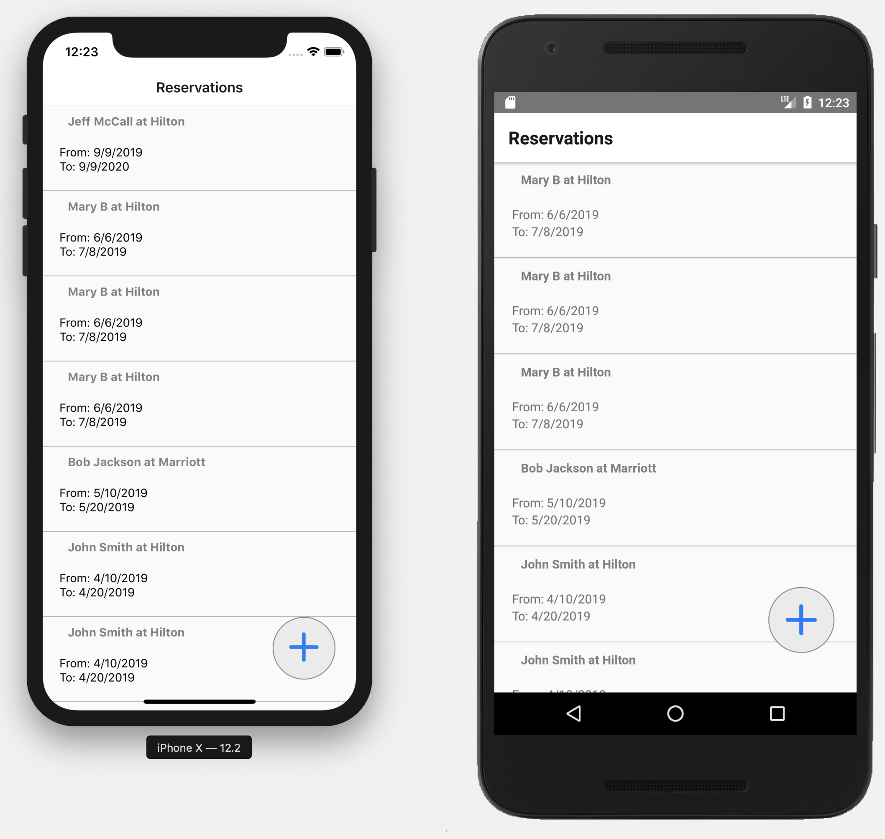
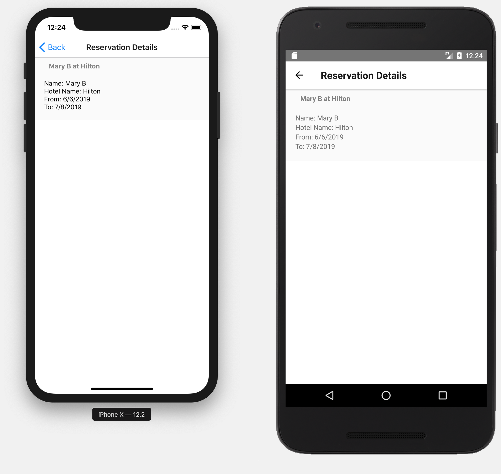
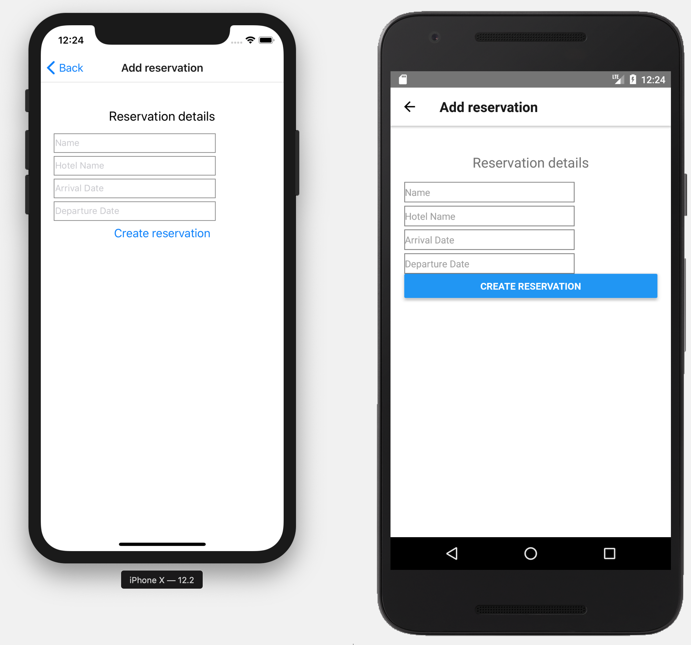

# Reservation App

Allows to get reservation list, get reservation details, create new reservation

Ingredients: react, react-native, react-navigation, graphql. Redux free. Never treated with create-react-native-app, or any other generator. 

## Quick Start

```bash
# accept all Android licenses (to run simulator) 
yes | sudo ~/Library/Android/sdk/tools/bin/sdkmanager --licenses

# Install dependencies
yarn

# and link them properly
react-native link react-native-gesture-handler
react-native link react-native-vector-icons


# run app in IOS simulator
react-native run-ios


# run app in Android simulator (start simulator first in AVD manager)
react-native run-android

```

## App Info


**Reservation List Screen** shows 30 most recent reservations on load.
 * Tap on list entry navigates to **Reservation Details Screen**
 * Tap on 'Add Button' navigates to **Add Reservation Screen**


**Reservation Details Screen** pulls reservation by id from backed and show it in read only mode

**Add Reservation Screen** displays form for new reservation. 
 * Tap on 'back' navigates to **Reservation List Screen**
 * In case of form completion and tap on 'Create reservation' submits new reservation to backend, refresh reservation list from backend and navigates to **Reservation List Screen**


## App tech info

 * All data manipulations are implemented with react-apollo client.
 * Couple reusable components are implemented (e.g. RoundButton, ReservationDetailsCard)
 * Configs are localized in configs.js
 * Couple tests are implemented 'yarn run test' (RoundButton.test.js has more test logic, ReservationDetailsScreen.test.js has test with Apollo data mock )
 * Flow is used for type checking
 * prettier is used for code formatting 'yarn run format'
 
### What else can be done (quickly upon request)

 * 'Reservation Details Screen' pulls 30 most recent reservations only. Infinite scroll can be implemented ... search, sorting, ...
 * Basic UI controls are used. Advanced UI libraries could be integrated (e.g. react native elements, native base, etc)  
 * No internationalization / localization so far. Could be added.
 * Much better styling
 * Any other functionality / elaboration 
  

## Screenshots






